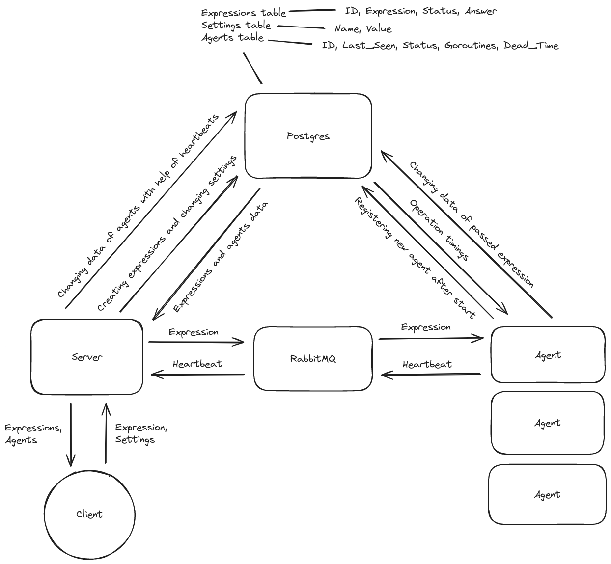

# distributed-calculator
`distributed-calculator` - это финальный проект второго спринта курса Go в Яндекс Лицее. Он представляет собой сервер и агентов, которые могут обрабатывать и решать выражения, разбивая их на подвыражения и решая максимально возможное количество операций параллельно для достижения большей эффективности (исходя из условий, описанных в ТЗ). В разработке использовались такие технологии, как `docker`, `postgres`, `rabbitmq`, а фронтенд был написан с помощью `htmx` для приятного взаимодействия пользователя с проектом. Ниже приведены шаги по установке и запуску всех необходимых ресурсов для запуска проекта, а также теоретическая часть, объясняющая, как все работает и взаимодействует друг с другом.

## Установка

Команды для запуска и настройки postgres и rabbitmq:
```
docker pull postgres
docker run --name pg-container -e POSTGRES_PASSWORD=pass -d -p 5432:5432 postgres
docker run -d --hostname my-rabbit --name rbmq-container -p 15672:15672 -p 5672:5672 rabbitmq:3-management
```
Создание таблиц в бд:
```
docker exec -ti pg-container psql -U postgres
```
После введения этой команды вы попадаете в psql, там нужно испонить следующие команды:
```
CREATE DATABASE "go-pg";
\c go-pg
CREATE TABLE calculations (id SERIAL PRIMARY KEY, expression TEXT, status TEXT, answer DOUBLE PRECISION);
CREATE TABLE agents (id SERIAL PRIMARY KEY, last_seen TEXT, status TEXT, goroutines INT);
CREATE TABLE settings (name TEXT, value INT);
INSERT INTO settings VALUES ('add', 5), ('sub', 5), ('mult', 5), ('div', 5), ('del', 60);
```
В папке http:
```
go run server.go
```
в папке проекта:
```
go run agent.go
```

## Теория


## Разбор критериев и вопросы
### Критерии
0. Необходимые требования:
   * Существует Readme документ, в котором описано, как запустить систему и как ей пользоваться.
   * Это может быть docker-compose, makefile, подробная инструкция - на ваш вкус
   * Если вы предоставляете только http-api, то в Readme описаны примеры запросов с помощью curl-a или любым дргуми понятными образом
   * Примеры полны и понятно как их запустить
- Этот пункт дает 10 баллов. Без наличия такого файла - решение не проверяется.
1. Программа запускается и все примеры с вычислением арифметических выражений корректно работают - 10 баллов
2. Программа запускается и выполняются произвольные примеры с вычислением арифметических выражений - 10 баллов
3. Можно перезапустить любой компонент системы и система корректно обработает перезапуск (результаты сохранены, система продолжает работать) - 10 баллов
4. Система предосталяет графический интерфейс для вычисления арифметических выражений - 10 баллов
5. Реализован мониторинг воркеров - 20 баллов
6. Реализован интерфейс для мориторинга воркеров - 10 баллов
7. Вам понятна кодовая база и структура проекта - 10 баллов (это субъективный критерий, но чем проще ваше решение - тем лучше).
   * Проверяющий в этом пункте честно отвечает на вопрос: "Смогу я сделать пулл-реквест в проект без нервного срыва"
8. У системы есть документация со схемами, которая наглядно отвечает на вопрос: "Как это все работает" - 10 баллов
9. Выражение должно иметь возможность выполняться разными агентами - 10 баллов
- Итого 110 баллов

### Мое мнение о критериях
0. Readme файл есть, инструкция по запуску приведена.
1. В галерее есть видеоролик работы программы с произвольными выражениями, правила написания выражений приведены на странице калькулятора, приветствуется ручная проверка (то же самое для 2-го пункта).
3. Если отключить db, то при попытке загрузки страницы будет появляться ошибка 500, а в агентах при попытке записать ответ в db в логах будет отображаться ошибка и выражение не пройдет валидацию и останется в очереди, при отключении очереди и агенты и сервер будут отображать в логах ошибку и сообщение, что через 30 секунд будет повторена попытка восстановить соединение и так далее, пока очередь не запустится, при полном отключении оркестратор или агенты не потеряют прогресс, так как все выражения хранятся в базе данных и в очереди, и пока агенты не поместят ответ в базу данных, выражение из очереди не исчезнет.
4. Имеется графический интерфейс в виде двух html-страниц с интуитивно понятным дизайном интерфейса.
5. Мониторинг агентов реализован на `/settings`.
6. Присутствует интерфейс для мониторинга агентов.
7. Весь код состоит из 4 файлов: `server.go`, `agent.go`, `calculator.html`, `settings.html`, каждый из которых подробно документирован, а в Readme есть раздел с общей структурой проекта.
8. В Readme есть отдельный раздел с общей схемой проекта.
9. Выражения берутся агентами из общей очереди, и если один агент занят решением одного выражения, второй агент может взять следующее для себя.

### Способы связи
Если у вас есть вопросы, вы можете написать мне в телеграм [@TalkierTick](https://t.me/TalkierTick) или открыть проблему на странице проекта.
